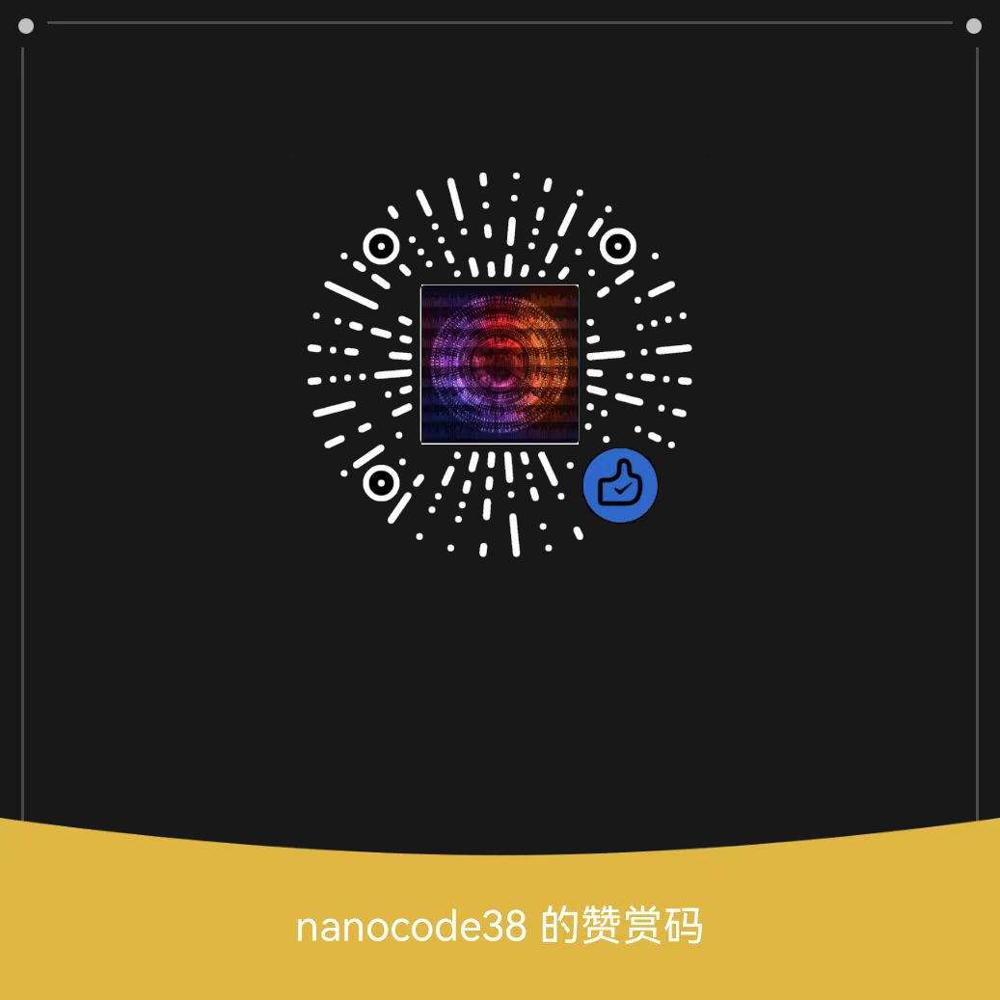

# Sound Keyboard
- [Chinese Version 中文版本](./README-CH.md)

## Introduction
Sound Keyboard is a simple software implemented in Python. It utilizes libraries such as pygame, tkinter, pynput, etc.

## Usage
**1. Download the source code in a usable directory**

**2. Run main.exe directly without downloading Python**

*Note: Sound Keyboard allows customization of keyboard sound files*

## Donation

<!--  -->

