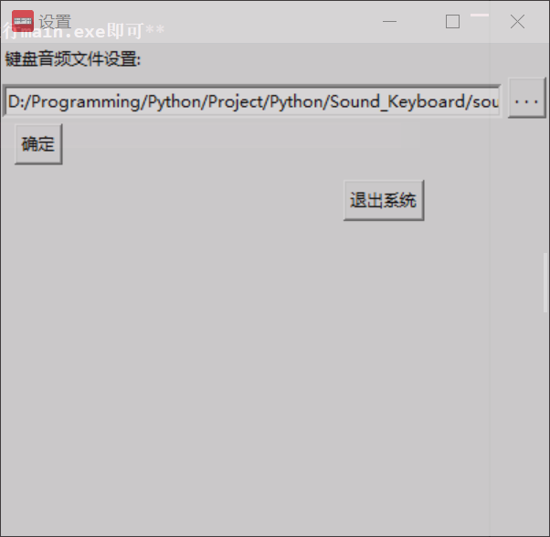

# Sound Keyboard

## Introduction
Sound Keyboard is a simple software implemented in Python. It utilizes libraries such as pygame, tkinter, pynput, etc.

## Usage
**1. Download the [source code](./README-CH.md) in a usable directory**

**2. Run main.exe directly without downloading Python**

Preview:

*Note: Sound Keyboard allows customization of keyboard sound files*

## Donation

*Sorry, the donation code has expired. Please consider donating later*
